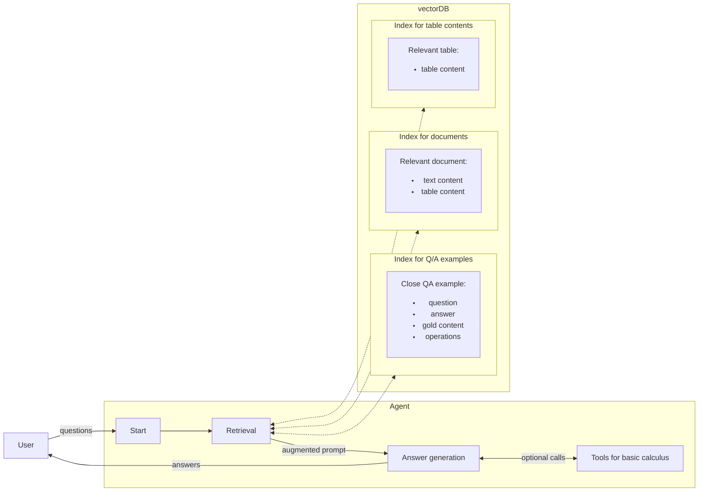

# Conversational LLM Application

Short summary

# Implementation Strategy

Given the limited time available, my goal was not to retrain or fine-tune an agent to natively handle well the structured data from the ConvFinQA dataset, but to work on prompts and tooling to give an agent not only resources to answer but also examples of how they should be processed.

This is implemented as a RAG over 2 different knowledge bases: one containing only the source documents from the ConvFinQA dataset and another containing the Question-Answer pairs themselves, to link the relevant content and operations performed.


### Embeddings model considerations

We use the excellent `BAAI/bge-m3` model to compute embeddings for the knowledge base. This model is used _locally_, thus it's also packaged with the app to handle queries.

### Preparation

The vector database was populated using the `preparation/prep_indexes.py` script, which is not necessary to run the app once the indexes are ready.

### Agent

The agent itself is a LangChain graph with a single generation step based on the `o4-mini` model served by OpenAI, chosen for its capacity to use tools.

## Challenges

* Combination of short time and unwilling to spend without counting for model use: limited experimentation (favor robustness over maximum efficiency)

## Leads for future improvement

If this was to become an actual tool, there are several areas to improve:

### Implementation

These concerns are practical and improve app security, robustness and performance:

* Segregate test dependencies & functionalities (typically switch to a dependency control tool like `poetry`)
* Switch to a configuration management system (hydra, pydantic-settings...) best adapted for deployment infrastructure
* Make cross-origin requests authorization as narrow as possible
* Ensure the parallelisation of vector store queries
* If possible, change the base image for the docker container to one with less vulnerabilities

### Functionalities

These are desireable functionalities that a production-grade system should seriously consider adding:

* Implement a streaming utility to add new data as needed
* Implement conversation checkpoints and add a store to remember previous conversations across sessions
* Optionally, introduce new metadata fields and filtering tools to the vector store in case we want to enforce data coming from a particular kind of document (source, report, date...)
* Calibrate the dicussion between using the knowledge base as a step or a tool for the agent (see the related item in `Anticipated QAs` below) to the needs of the user ; as this is probably one of the best ways to reduce the number of empty answers (see `Evaluation`). If retrieval is kept as a step, then at least experiment with and optimize the number of retrieved items for each vectorDB lookup.


## Evaluation Strategy

To maximize the validity of the evaluation and since this implementation does not contain any learning phase, we can segregate a few examples (e.g. 10%) of the original training dataset to use for testing. We maintain a QA index for testing purposes only, which does not contain said examples.
Thus, if we query the agent for these questions, it will not be given the exact answer by the retrieval phase. The questions segrated this way for evaluation were generated using the `preparation/prep_eval.py` and can be read from the `data/convfinqa_qa_eval.json` file.

Furthermore, we constrain the output of the model to a given format which can be parsed easily to retain numbers and units. The reason to use the direct output here instead of assigning values to the state of the agent is that we want to evaluate what the user would read.

In practice, this is achieved using the scripts in the `evaluation` submodule. The script will first find out if an answer is a perfect match for the one provided in the original dataset ; if not, it will attempt to isolate number-based answers and compare said numbers (with possible adjustments) ; and finally if no decision can be made from there it will resort to an arbiter: yet another LLM agent, which will be provided the context for the question and prompted to decide if the answer is acceptable in regard to the expected answer.

### Results

The results from the comparison are grouped as such:
* **perfect answers** match the expected answer string or match its number value with less than a 1% error
* **acceptable answers** either have a number value less than 10% apart from the expected value (for number-based questions) or are deemed acceptable by the arbiter LLM
* **question not answered** received an empty answer
* **wrong answers** are non-empty answers which do not match the expected one and were not deemed acceptable. A small portion of them does explicitly refer an unkown answer or report unsufficient data. 

```json
{
    "total questions": 397,
    "questions not answered": 94,
    "perfect answers": 125,
    "acceptable answers": 23,
    "wrong answers": 155,
    "admits uncertainty": 9,
}
```

This simple approach to the problem, evaluated on the subset of 10% of the ConvFinQA training dataset withheld from providing the exact answers, produces acceptable or better answers for 148 questions and wrong answers for 155 questions. More concerningly, it does not answer at all for 94 questions.

### Enquiry on empty answers

A dive into the request bodies from the OpenAI requests seems to rule out issues of type number of tokens exceeded or errors of the same kind. From there, we can surmise this is akin to admitting uncertainty (even if a deeper dive to confirm it would be beneficial).

## Anticipated Q&As

#### Why use Pinecone as a vector DB solution?

It is remote, handles low-level API requests, and has a sizeable free tier. It also handles up to 40 kB of metadata per vector, which is sufficient to store the documents from the dataset (pre-text, table and post-test sum up to 14.25 kB at most), thus is doubles as a document database.

#### Why use a single index with namespaces instead of 3 indexes?

Mostly because the problem is static and I intented to use the same encoding model for all namespaces.

#### Why not use a langgraph prebuilt?

Langgraph is a great tool, but I wanted to showcase my prompt engineering in the most direct way, hence the explicitly-defined steps and states changes for the agent.

#### Why definiting the Retrieval as a `Step` and not a `Tool`?

In this problem, we do not want the reference to the knowledge base to be optional. Thus, with little time to experiment around agent behaviour and tendency to use the tools at its disposal, we do not provide the answering agent with control over the kind and the number of queries to the knowledge database.

This is an important point for potential improvement of the system, especially if we interpret most of the app current wrong answers as being induced by missing the essential data from the retrieval step and not being able to query either more item or make an adjusted query. but it seemed like something to implement with a bit more time to ensure some robustness.

# Codebase

## Structure

```
tmr/
├── app/              # Application source code
│   ├── main.py       # Main application entry point
│   ├── deployment/   # Utilities needed to finalize deployment
│   ├── llm/          # LLM agent integration module
|   └── rag/          # Knowledge base module
├── data/             # Data directory for initial dataset model files and evaluation subset
├── evaluation/       # Script directory to evaluate the quality of the app's answers
├── preparation/      # Script directory to set up the application indexes & backbone, not required at execution time
├── static/           # Static artifacts for web pages to serve
├── tests/            # Test files  
├── .env_config       # Configuration file for the app
├── Dockerfile        # Docker configuration
├── requirements.txt  # Python dependencies
└── README.md         # This file
```


## Installation

Create and activate a virtual environment, then install dependencies

```bash
python -m venv venv
source venv/bin/activate  
pip install -r requirements.txt
```

## Running the Application

Run the application locally:

```bash
python -m app.main
```

## Running Tests

Run tests with coverage report:

```bash
pytest --cov=app tests/app/
```

Some unit tests for the evaluation script are also provided in the `tests/evaluation/` subfolder.

## Docker Support

This app can be packaged as a docker container for portability and potential hosting.

The container includes all the code needed to run the app, including a packaged version of the embeddings model.

See the `Dockerfile` instructions for more details.

### Building the Docker Image

```bash
docker build -t convfinqa-app-docker .
```

### Running the Docker Container

```bash
docker run -p 8000:8000 convfinqa-app-docker.tar
```

### Exported image

An export of the app is made available in the `convfinqa-app-docker.tar` image tarball.

## Configuration

The application can be configured using environment variables or a `.env` file. Default configuration is listed in the `.env_config` file.

# References used for the development

* [Pinecone guide for implementing Pinecone RAG as LangGraph tool](https://colab.research.google.com/github/pinecone-io/examples/blob/master/docs/langchain-retrieval-agent.ipynb#scrollTo=DtSXR5RXdyU0)
* [Lanchain guide on defining RAG as a graph step](https://python.langchain.com/docs/tutorials/rag/#preview)
* [HOWTO: deploy huggingface-referenced local models to Docker container](https://fgiasson.com/blog/index.php/2023/08/23/how-to-deploy-hugging-face-models-in-a-docker-container/)
* [Model card for the OpenAI `o4-mini` API](https://platform.openai.com/docs/models/o4-mini)
